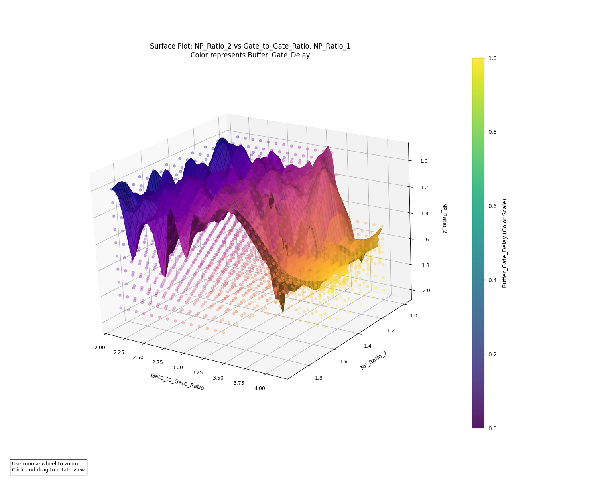
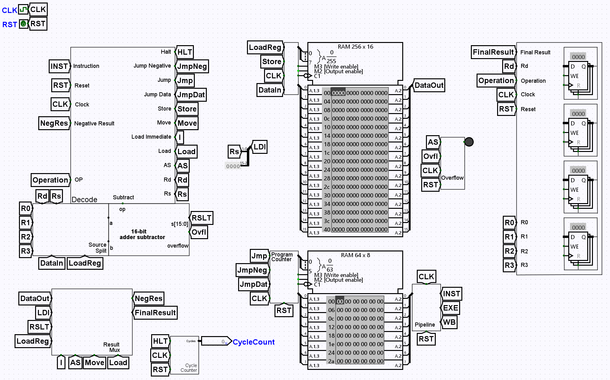

# Digital Electronics Coursework

## Description
In this course we covered content from all walks of an introductory ECE course. The course begins with circuit construction and analysis physically using oscilloscopes. From here the course moves to the ability to analyze more complex circuits using a circuit simulator (NgSpice). NgSpice is text based and so the generation of the circuits is built into the same file as the graphing functionality. After low level circuit analysis we covered digital simulation starting with making simple gates from transistors all the way to constructing a computer out of pure logic*. To simulate these circuits we use Logisim Evolution. (In my process of this course I used the version 3.9.0) Next we continue on to programming our created computer but quickly graduate to writing programs in ARM assembly. Finally, we finished out the year with FPGA work in Verilog. 

## Content Overview
In course order:

- Oscilloscope Graphs 
    - This folder contains some graphs generated through my use of the in class oscilloscopes. There are included translated PNG files for quick viewing, and the raw BMP files for those that are more interested in content.
- myCircuits
    - This folder contains most of the circuits I created during the process of the course. One of the most interesting files is my included buffer sweep in which I attempted to optimize some buffers given a size constraint.
- Models 
    - This was a given model for a TSMC transistor used in some of the circuits.
- Logisim Assignments
    - This folder contains all the major digital logic assignments in the course. A number of the assignments will not meet the current requirements of the course because after the creation and submission of them I optimized specific parts of them to be more readable and in some cases faster. 
- Assembly
    - This folder contains most of the assembly programs that I wrote for the assignments in the class. These are all intended to be used with a recent version of the ARM assembler or an ARM simulation tool.
- (Not Included) Altera + Quartus FPGA Design
    - The projects done in Altera and Quartus for FPGA design are currently on a school owned computer, but I will work to include them in this repository as soon as feasibly possible. 

## Coursework Example

### Buffer Sweep Visualization

This diagram shows the buffer delay based on the gate to gate ratio and the Nmos to Pmos ratios for each transistor in the pair. The data for this visualization comes from the varied simulations that I wrote in spice. The visualization uses matplotlib, numpy, and scipy in order to generate the graphic in this way.

### Full Computer Simulation

This is the main file for my computer that I constructed in Logisim. As is visible, this implementation uses the built-in RAM from Logisim. While this is true, we covered how to create our own RAM in the course, but did not implement it in the computer in order to improve the speed of the simulations. 

## License 
I do not give permission for any of this work to be used or copied by those that are currently taking this course (Digital Electronics at Liberal Arts and Science Academy). If you see this repository in search of help in your course feel free to reach out and email me with any questions you may have. If you are not taking this course currently I highly suggest you look around the different projects that I have completed here and find as much interest in them as I have. I plan to add more explanation at a further date.
